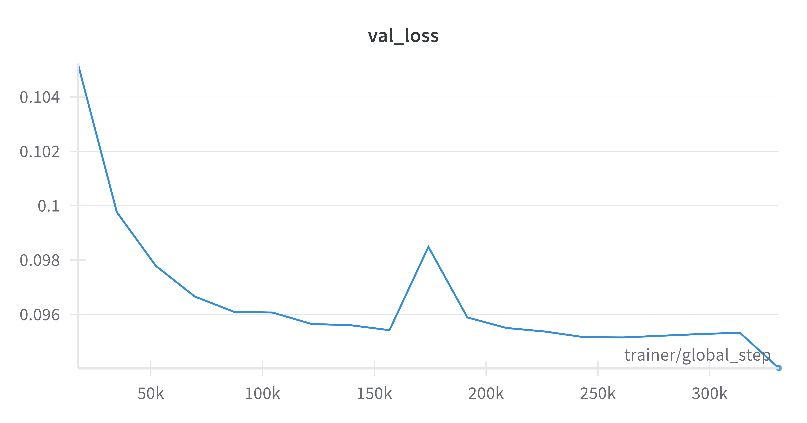
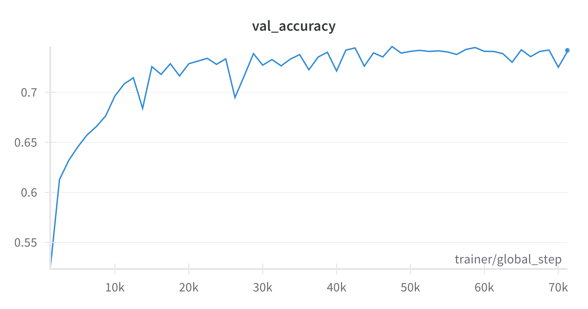
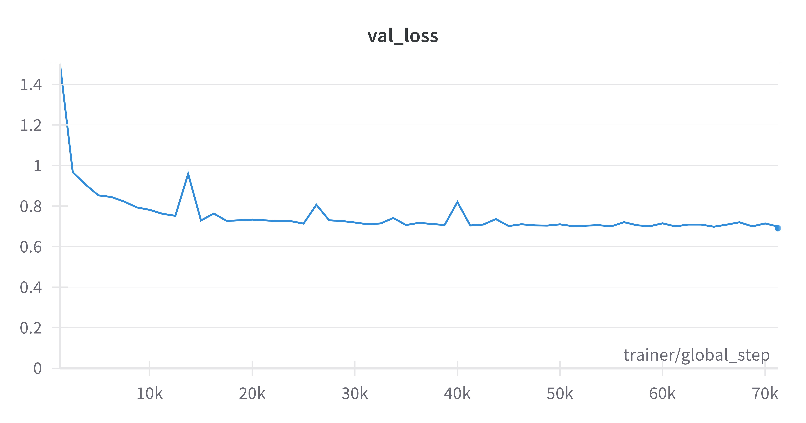
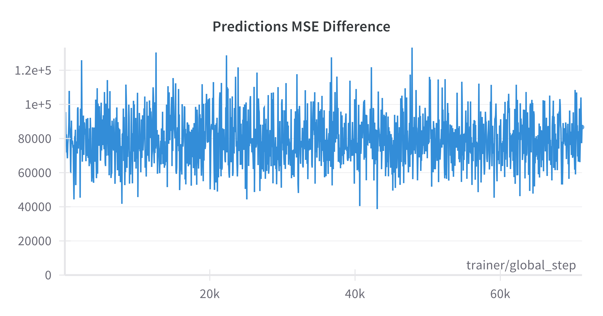
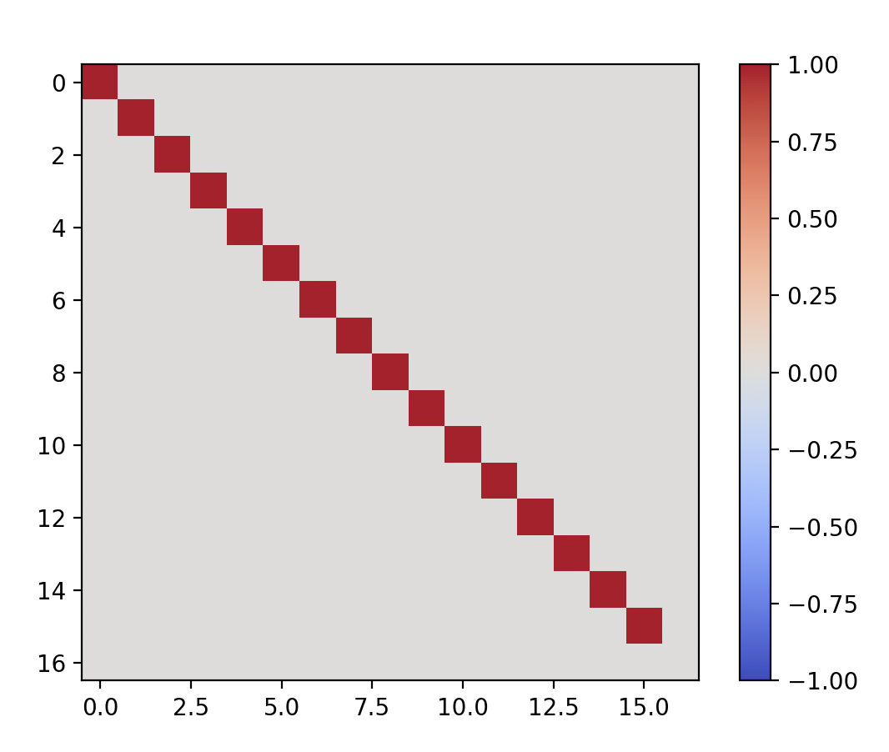
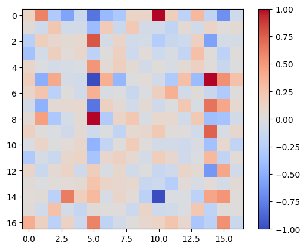
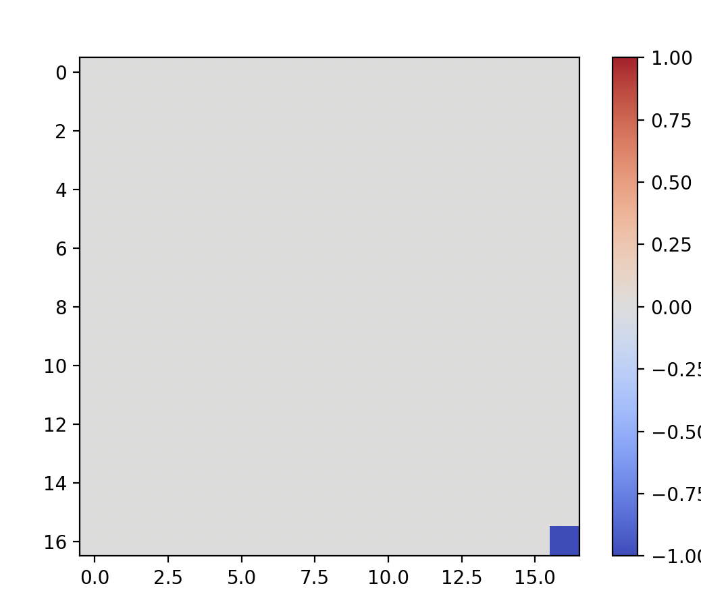
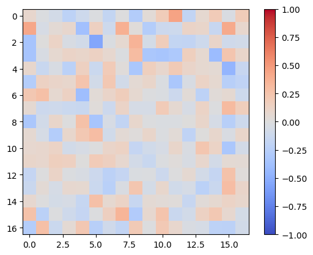

# Proposal
In-context learning forms the basis of modern models’ capabilities.

As a behaviour it is poorly understood.

Various formulations have been proposed.
This work uses gradient descent.

We extend this to a testbed of formal languages. 

# Motivation
Extend to a meaningful toy setting – formal languages.

Well-studied and easily controllable.

Better than the random task used in the paper – more interpretable insights.

# Setup
Each input sample consists of a set samples $(x_i, y_i)$.

This is followed by a test sample $x_\text{test}$.

For nonlinear tasks, the embeddings are passed through an MLP first.

An LSA layer is trained on these representations to solve the task.

# Extension 1: Domain
Use a string membership task in a fixed formal language.

Formulate as regression by fitting to ±1.

We choose regular languages.

# Extension 2: Setup
The authors train an end-to-end model for nonlinear regressions.
This uses an MLP and an LSA layer.

One issue with this is that the separation between linearization and GD is presupposed (mid-eval).

We fix this by using an independently trained autoencoder.

# Experiments
We use the following regular languages:
$$a*bc*; ((a|b)c)*; (ab[c])*$$

First, we train an autoencoder to encode strings from these languages.

We then train an LSA layer to predict in-context string membership from this representation.

We also construct an LSA layer that is expected to perform GD on the inputs.

# Analysis
Throughout training, we compare the predictions of the training model with the predictions of the construction (MSE).

We also compare heatmaps of the learned LSA layer with the construction.

# Results: Autoencoder Validation Loss

# Results: Classifier Validation Accuracy and Loss
{ height=30% }

{ height=30% }

# Results: MSE of Classifier Predictions

# Results: $QK$ Heatmaps
{ height=30% }

{ height=30% }

# Results: $PV$ Heatmaps
{ height=30% }

{height=30% }

# Conclusions
The model learns to solve the task with an accuracy of about 75%.

The results do not match the authors' predictions.

There are multiple possibilities for this:

* The authors' setup relies on the MLP-LSA end-to-end training (extension 2), which we do away with.
* The task is "too" non-linear. 